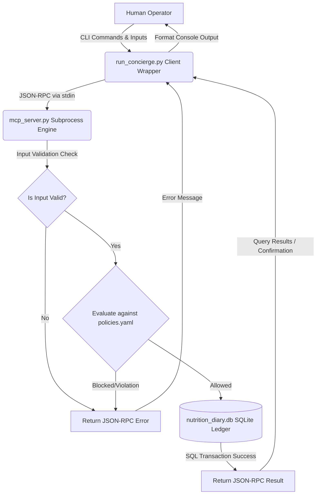

# Nutrition Concierge

An offline, zero-cloud dependency, local macronutrient, water, and supplement tracking application. It utilizes the Model Context Protocol (MCP) tool schema style to communicate with a localized SQLite ledger over a lightweight JSON-RPC stdin/stdout console loop.

## 📌 The Problem
Modern nutrition trackers and smart health apps frequently require cloud-based accounts, sync personal biometric details to external remote endpoints, or enforce external AI model dependencies (using online API keys). This architecture exposes highly sensitive, private personal health records to data breaches, tracking, and latency issues, violating basic security principles of **Data Sovereignty** and **Personal Sovereignty**.

## 🛡️ The Solution
**Nutrition Concierge** solves this by establishing a **100% Local Runtime Sandbox**.
- **Zero API Keys**: No connections to external cloud models, third-party trackers, or API endpoints.
- **Sovereign Local Storage**: All inputs (calories, protein, carbohydrates, sugars, water, and supplement intake logs) are safely saved within a local SQLite database (`nutrition_diary.db`).
- **Shift-Left Security & Verification**: Robust input validation blocks negative integers, empty fields, and malformed strings before they ever touch database tables. Database constraint violations or operational errors are caught safely and handled with clean console feedback.
- **Granular Adjustments**: A dedicated `adjust` mechanism allows users to inspect individual daily logged entries, delete specific records, and toggle individual supplements.

---

## 🏗️ Architecture

The system utilizes a decoupled Client-Server architecture:
1. **Client Wrapper (`run_concierge.py`)**: Interacts directly with the human operator, prompts for meals/macros/water/supplements, formats JSON-RPC requests, parses responses, and prints terminal progress dashboards.
2. **Database MCP Engine (`mcp_server.py`)**: Launches as a subprocess, initializes the local database ledger, performs safety schema upgrades, validates inputs, and executes SQL transactions.
3. **Security Policies (`policies.yaml`)**: Governs tool restrictions, execution permissions, environment sandboxing, and strict guardrails.

### System Data Flow



---

## 🔒 Security Policies (`policies.yaml`)
To ensure robust security sandboxing, the system loads a strict security posture defined in [policies.yaml]:
- **Environment Isolation (`localhost_sandbox`)**: Explicitly blocks execution of arbitrary shell commands, modifying the core test harnesses, or bypassing validation functions.
- **Role-Based Access (`nutrition_concierge_executor`)**:
  - Restricts access to four core tools: `write_food_macros`, `update_supplement_checklist`, `delete_food_entry`, and `query_local_diary_db`.
  - Enforces guardrails such as least privilege, sanitizing execution context, blocking medical prescriptions, and restricting to non-interactive CLI access.

---

## 🛠️ Getting Started & Setup

### Requirements
- Python 3.8+ (no third-party dependencies required, runs entirely on the standard library)

### Step-by-Step Execution

1. **Clone or Navigate to the Workspace Directory**:
   ```bash
   cd /Users/zhi.ye/Documents/antigravity-projects/nutrition-concierge
   ```

2. **Launch the Main Terminal Loop**:
   Run the interactive concierge loop directly in your shell:
   ```bash
   python3 run_concierge.py
   ```

3. **Available Commands**:
   - `log meal`: Prompts you to log a meal entry. You will enter food name, calories, protein, carbohydrates, sugar, and water intake.
   - `take supplement`: Registers a supplement as taken. Supported options include Multivitamin, Fish Oil, ACV, D3, and Joint Health.
   - `summary`: Prints today's total budgets for all five nutritional pillars, your water progress against a 128 oz daily target, and your checklist status.
   - `adjust`: Lists today's detailed food log entries (with database IDs) and allows deleting specific records or toggling supplements back to missing.
   - `exit`: Safely terminates the MCP engine subprocess and closes the program.
